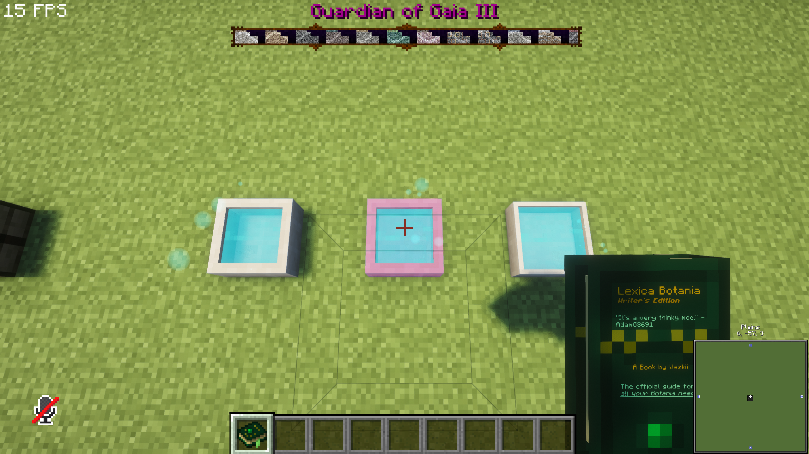
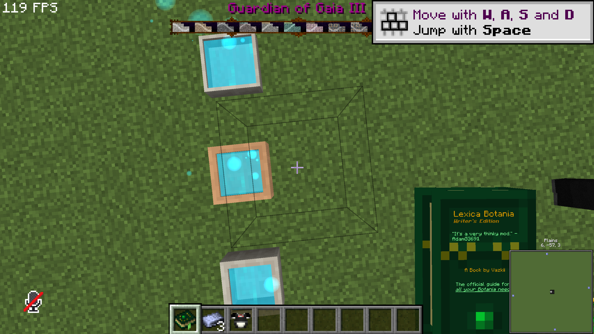

# Botania — Unofficial NeoForge Port

An unofficial Minecraft 1.21.1 NeoForge port of Botania, with compatibility fixes for ExtraBotany: Reburn.

**Minecraft:** 1.21.1 · **Loader:** NeoForge · **Validated loader:** 21.1.248 · **Java:** 21 · **Version:** 457.1 (runtime metadata includes SNAPSHOT).

Botania is a technology mod themed around natural magic: flowers generate and use mana to power equipment, devices, and crafting. This fork adapts the supplied port to NeoForge 1.21.1 and supports the matching ExtraBotany addon.

## Installation

Install the runtime JAR in mods on both client and server. Required dependencies: Patchouli and Curios for NeoForge 1.21.1. Source JARs are for reading code, not installation. Never install this fork alongside another mod with the same mod ID.

## Changes in this fork

- Restore enchanted soil, overgrowth seeds, and ender-air bottles used by ExtraBotany.
- Resolve renamed legacy item and block IDs without registering duplicate content.
- Fix opaque alpha in the held Lexica Botania model.
- Render animated mana surfaces through the standard translucent entity pipeline for Iris compatibility.

## Credits and license

Botania was created by Vazkii and maintained by the Botania contributors. DragonFire supplied the initial 1.21.1 port. Kirillich611 maintains this unofficial compatibility fork.

Original project: https://github.com/VazkiiMods/Botania

License: **Botania License**. Original license files and file-specific notices remain part of this repository. This is an independent fork and is not presented as an official or endorsed release.

## Build and development

Install JDK 21 and set JAVA_HOME, then use the included Gradle wrapper. The first build needs network access for dependencies; offline builds require a populated cache.

```powershell
.\gradlew.bat :NeoForge:assemble
```

launch-client.cmd launches a development client from the current source. launch-server.cmd launches a development server in its console. Review and accept Minecraft's EULA yourself if the server asks; the launchers do not accept it automatically.

## Validation and limitations

Both mods were built and checked as a pair. Nine addon GameTests passed, including 201 recipe-codec round trips and matching/assembly of all 108 ordinary crafting recipes. ExtraBotany PMD and Spotless checks passed.

A copied profile with 188 mods loaded the test world. Normal, diluted, and fabulous mana pools and the held lexicon rendered with Complementary Reimagined r5.9.3 / Euphoria Patches 1.10.5 enabled and disabled. Gaia ingots and the Pleiades Combat Maid Suit had visible inventory textures. Full playthroughs, complete boss fights, and optional EMI/KubeJS integrations were not verified.

Test existing saves on a copy first: some old quartz block-item IDs are reused for crystals in the new Botania code, and registry aliases cannot distinguish that reuse.

## AI disclosure

Generative AI assisted porting, compatibility fixes, and preparation of this documentation. The project is based on the original human-authored mods. Build checks, automated tests, and limited runtime checks do not establish that every gameplay feature works. Project-page disclosure fields must accurately reflect this assistance; gallery screenshots are actual game captures.

## Сообщество и исходники

Неофициальный порт для Minecraft 1.21.1 / NeoForge. Ответственный за этот форк: Kirillich611. Автор исходного порта Botania: DragonFire. Авторы оригиналов: Vazkii и команда Botania; Lounode и команда ExtraBotany.

О найденных ошибках сообщайте в Issues этого форка, приложив версии модов, действия для воспроизведения и лог или crash report без личных данных.

## Screenshots

Actual captures from the test profile; shader and other-mod visuals belong to their respective projects.




